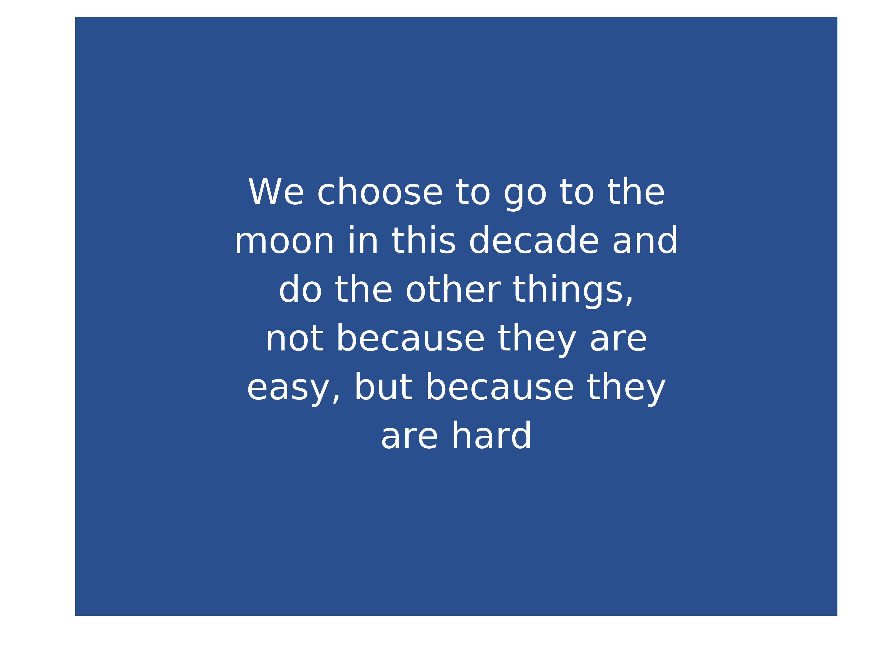

# Poster making API
## (for AWS Lamba, via Zappa)
A little API to make a poster image from some text, able to run serverless on [AWS Lambda](http://docs.aws.amazon.com/lambda/latest/dg/welcome.html) using [Zappa](https://github.com/Miserlou/Zappa).

# Example response
`https://mybucket.s3.amazonaws.com/someuuid.png?AWSAccessKeyId=something&Signature=something&Expires=1505730148`



# Example request
```
curl -X POST \
https://something.execute-api.eu-west-1.amazonaws.com/dev/wordcloud \
  -H 'content-type: application/json' \
  -d '{
	"text": "We choose to go to the moon in this decade and do the other things, not because they are easy, but because they are hard",
	"bgcolor": "#2A4F8F",
	"fgcolor": "#FFFFFF"
}'
```

# Installation
```
pip install -r requirements.txt
zappa init
zappa deploy dev
```

# Licence
MIT